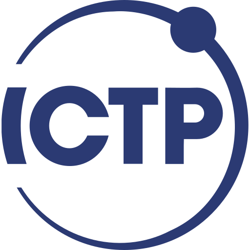
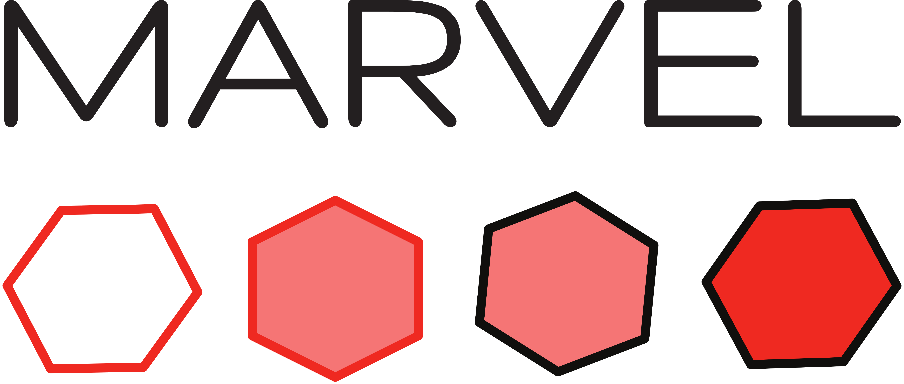
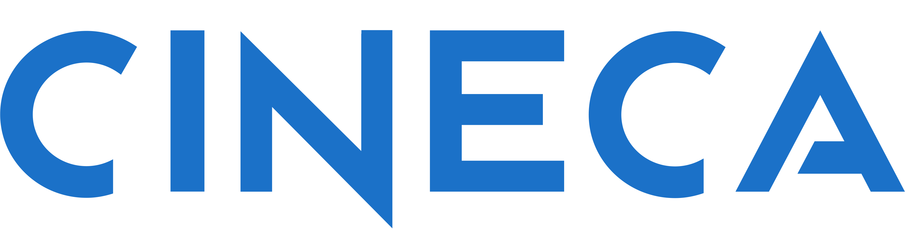

# ICTP-MARVEL College 2026

Materials for the hands-on sessions of the [Joint ICTP–MARVEL College: Materials Simulations in the Age of AI](https://indico.ictp.it/event/11146), held at ICTP, Trieste, 1–12 June 2026.

Organized by Sara Bonella, Michele Ceriotti, Nicola Marzari, and Sandro Scandolo.

## Contents

`before/` contains instructions for you to follow _before_ you arrive in Trieste (installing `Quantum Mobile` and performing some basic tests)

Each `day-XX/` directory contains the materials for the corresponding day's hands-on session.

- **Week 1** — electronic-structure theory and spectroscopy: DFT and beyond, lattice dynamics, many-body perturbation theory, topology and Wannier functions, advanced functionals.
- **Week 2** — statistical mechanics and machine learning: molecular dynamics, enhanced sampling, ML for materials and interatomic potentials.

## Sponsors

  
  &nbsp;&nbsp;&nbsp;&nbsp;
  
  &nbsp;&nbsp;&nbsp;&nbsp;
  
  &nbsp;&nbsp;&nbsp;&nbsp;
  

